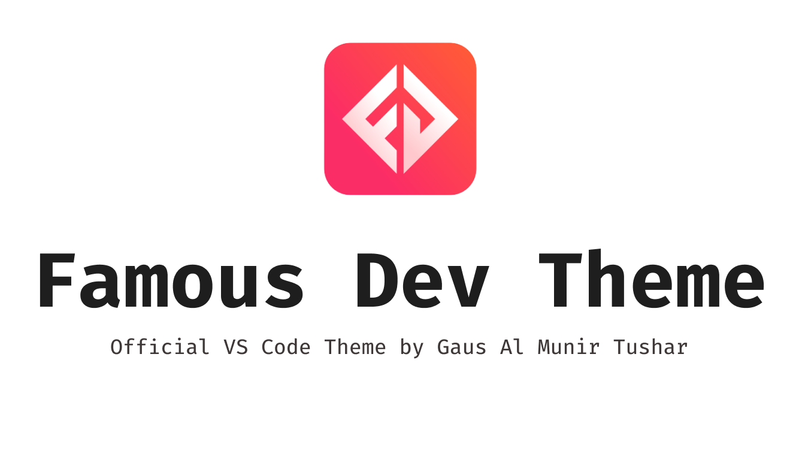

# Famous Dev Theme

## Installation
Open Extensions sidebar panel in VS Code. View → Extensions
Search for Famous Dev Theme - find the one by Gaus Al Munir Tushar - there are a few other half-baked ones so make sure you have the right one!
Click Install to install it.
Code > Preferences > Color Theme > Famous Dev Theme
Optional: Use the recommended settings below for best experience

* Split the editor (`Cmd+\` on macOS or `Ctrl+\` on Windows and Linux).
* Toggle preview (`Shift+Cmd+V` on macOS or `Shift+Ctrl+V` on Windows and Linux).
* Press `Ctrl+Space` (Windows, Linux, macOS) to see a list of Markdown snippets.

Copyright © 2023 Gaus Al Munir Tushar
